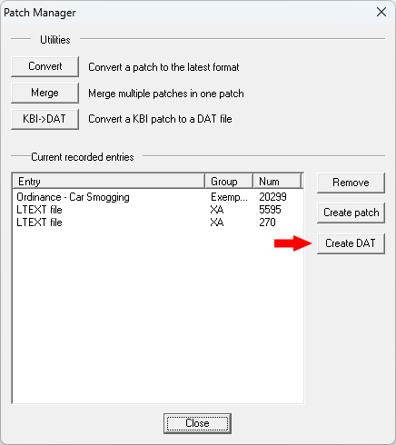

# Tutorial for Creating New Ordinances

This tutorial covers the basic steps required to create a new ordinance for use with this plugin.
<!--TOC-->
  - [Extracting an Ordinance Exemplar From SimCity_1.dat](#extracting-an-ordinance-exemplar-from-simcity_1.dat)
    - [Step 1](#step-1)
    - [Step 2](#step-2)
    - [Step 3](#step-3)
    - [Step 4](#step-4)
  - [Changing the Exemplar and LTEXT Instance IDs](#changing-the-exemplar-and-ltext-instance-ids)
    - [Step 1](#step-1-1)
    - [Step 2](#step-2-1)
  - [Updating the Ordinance Name and Description](#updating-the-ordinance-name-and-description)
    - [Step 1](#step-1-2)
    - [Step 2](#step-2-2)
    - [Step 3](#step-3-1)
    - [Step 4 - Optional](#step-4-optional)
  - [Configuring the Ordinance Properties](#configuring-the-ordinance-properties)
    - [Adding New Properties](#adding-new-properties)
    - [Removing Existing Properties](#removing-existing-properties)
<!--/TOC-->

## Extracting an Ordinance Exemplar From SimCity_1.dat

As an alternative to this section, you could make a copy of *SpaceExplorationProgramOrdinance.dat* in the [examples](../examples) folder.    
The DAT will not be an override because we will be changing the instance ids in the next section. 

### Step 1

Launch Reader v0.93, load SimCity_1.dat, and click the *Navigator* button.

### Step 2

1. Expand the Ordinance tree.
2. Expand the ordinance you want to copy.
3. Right-click on the ordinance entry and select Add to Patch.
4. Repeat step 3 for the *Name Key* and *Description Key Type 2* entries below the ordinance exemplar.

### Step 3

Close the Navigator and select the *Patch* button.

### Step 4

Click _Create DAT_ and save it into *SimCity 4/Plugins/140-ordinances*.

## Changing the Exemplar and LTEXT Instance IDs

### Step 1

Open your newly created ordinance DAT in Reader v0.93.

### Step 2

1. Right click on the ordinance exemplar and select *Generate New Instance*.
2. Repeat the above actions to a generate new instance ids for the LTEXT files.

## Updating the Ordinance Name and Description

### Step 1

1. Click on each of the LTEXT files and update the name and description for your ordinance.
2. Click *Apply* after editing the name or description.

### Step 2

1. Click on the ordinance exemplar.
2. Double click the *Name Key* entry.
3. Change the last value to the instance id of the LTEXT file containing the name of your ordinance.
4. Click *Apply* after editing the value.
5. Click *Apply* to close the dialog.

### Step 3

1. Click on the ordinance exemplar.
2. Double click the *Description Key* entry.
3. Change the last value to the instance id of the LTEXT file containing the description of your ordinance.
4. Click *Apply* after editing.
5. Click *Apply* to close the dialog.

### Step 4 - Optional

Change the *Exemplar Name* property in the ordinance exemplar to the name of your ordinance.
This is not required for the ordinance to function, but it makes it easer to tell what the ordinance is when editing it. 

## Configuring the Ordinance Properties

See [Ordinance Exemplar Properties](Ordinance_Exemplar_Properties.md) for a list of the ordinance properties that can be customized.

### Adding New Properties

Right click in the exemplar editing pane and select *Add property*.

> [!NOTE]
> You may have to apply the property with a default value and then double click to edit it and set the actual value.

### Removing Existing Properties

Click on the property to highlight it, then right click and select *Delete property*.

